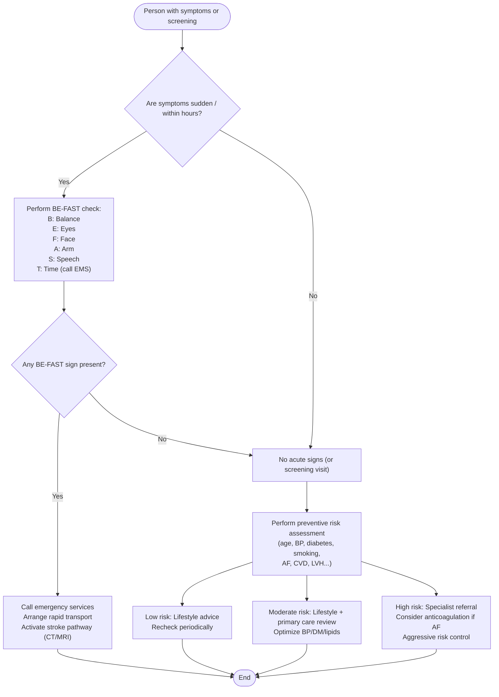

# Stroke Screening Algorithm

## Overview
Combined tool for:
- **Acute recognition**: BE-FAST (rapid field screening for possible acute stroke).
- **Preventive risk assessment**: Framingham-style risk factors for primary prevention.

---

## BE-FAST (use for **acute** sudden symptoms)
- **B**alance — sudden loss of balance/coordination  
- **E**yes — sudden visual disturbance or loss  
- **F**ace — facial droop (ask to smile)  
- **A**rm — arm weakness or drift (ask to raise both arms)  
- **S**peech — slurred/strange speech (ask to repeat a sentence)  
- **T**ime — if *any* sign is present, call emergency services immediately

---

## Flowchart (Mermaid)

